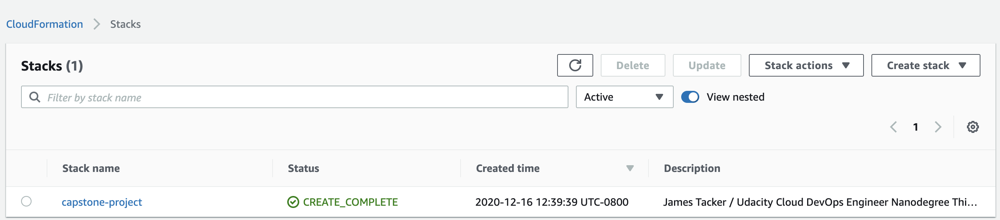
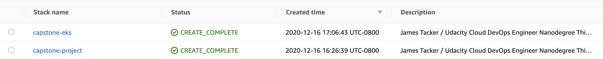

# Cloud DevOps Engineer Capstone Project

This project is the final project of the Cloud DevOps Engineer Udacity Nanodegree. The project showcases all skills and knowledge acquired throughout the Cloud DevOps Nanodegree program which included:

* Provisioning network resources in AWS with CloudFormation / Ansible
* Containerizing applications with Docker
* Building CI/CD pipelines with Jenkins / CircleCI
* Building and deploying microservices in a Kubernetes cluster

#### Table of Contents
1. [The Sample App](#the-sample-app)
2. [Setup a Local Deployment](#setup-a-local-deployment)
    1. [Python virtual Environment](#python-virtual-environment)
    2. [Local Docker Deployment](#local-docker-deployment)
    3. [Local Kubernetes Deployment](#local-kubernetes-deployment)
3. [Setup an AWS EKS deployment]()
    1. [Use CloudFormation to Provision Network and EKS Resources](#use-cloudformation-to-provision-network-and-eks-resources)
    2. Jenkins Pipeline
    
## The Sample App
The app I decided to use (I call it the __dragon ball z database__) is a microservice reference architecture using `flask` (frontend) and `mongodb` (backend). 

The `flask` app is a simple router with a single endpoint (`/dbz`) that accepts `GET`, `PUT`, and `POST` methods and then routes to a `mongodb` instance.
## Setup a Local Deployment

__Requirements__
* Install Python 3.7
* Install Docker
* Install `minikube` (comes bundled with Docker Desktop)

### Python Virtual Environment
1. Clone the repository:
    ```bash
    git clone https://github.com/spider-sauce/cloud-devops-capstone.git
    ```

2. Setup `venv`:

    ```bash
    python -m venv ~/.capstone
    source ~/.capstone/bin/activate
    ```

3. Run `make install && make lint`
4. Download and [run the `mongod` service](https://docs.mongodb.com/guides/server/install/)
5. Run `python app.py` to run the flask app.
6. Test the app stack:
    > These examples use [cURL](https://curl.se/)
    
    ```bash
    # Test the app
    curl http://localhost:5000/dbz
    
    # Insert data
    curl -v -X POST -H "Content-type: application/json" -d \
    '{"name":"Goku", "powerlevel": 150,000,000}' \
    'http://localhost:5000/dbz'
    
    # Test the record
    curl http://localhost:5000/dbz/Goku 
    ```

### Local Docker Deployment

1. Install [Docker Compose](https://docs.docker.com/compose/install/).
2. Launch the app stack: `docker-compose -f docker-compose.yml up -d`
3. Ensure the containers deployed and are running:
    
    ```bash
    cloud-devops-capstone % docker ps
    CONTAINER ID   IMAGE            COMMAND                  CREATED       STATUS       PORTS                      NAMES
    ada25e53f6dd   dbz-app:latest   "python app.py"          6 hours ago   Up 6 hours   0.0.0.0:5000->5000/tcp     dbz-app
    a1c987fe96b4   mongo:latest     "docker-entrypoint.s…"   6 hours ago   Up 6 hours   0.0.0.0:27017->27017/tcp   mongodb
    ```
4. Test the app stack (see step 6 in [local python deployment](#python-virtual-environment))
5. Tag and push the `dbz-app` to DockerHub
    
    ```bash
    docker tag dbz-app:latest <dockerhub-username>/<app-name>:<tag>
    docker push <dockerhub-username/<repo-name>:<tag>
    ```

### Local Kubernetes Deployment

1. Download and install `minikube`. Then start the cluster:
    
    ```bash
    minikube start
    ```
   
2. Send the `deployment`:
    
    ```bash
    kubectl apply -f kube/deployment.yaml
    ```
   
3. Send the `loadbalancer`:
    
    ```bash
    kubectl apply -f kube/loadbalancer.yaml
    ```
4. With `minikube`, you must launch a `tunnel` to use the `LoadBalancer` service:
    
    ```bash
    sudo minikube tunnel
    ```
   
5. Get the services to gather the `EXTERNAL-IP`
    
    ```bash
    kubectl get service
   
    NAME           TYPE           CLUSTER-IP       EXTERNAL-IP   PORT(S)           AGE
    dbz-app        NodePort       10.108.4.164     <none>        5000:31828/TCP    5m3s
    kubernetes     ClusterIP      10.96.0.1        <none>        443/TCP           5m22s
    loadbalancer   LoadBalancer   10.107.181.204   127.0.0.1     80:30582/TCP      4m59s
    mongodb        NodePort       10.104.18.254    <none>        27017:30444/TCP   5m4s
    ```
   
6. Test the application against `http://127.0.0.1/`. See step 6 in [local python deployment](#python-virtual-environment)) for the specific test commands.

## Setup an AWS EKS deployment

__Requirements__
* AWS CLI with permissions to create the following resources:
    * VPC
    * Subnets
    * Internet Gateway
    * Router
    * EKS Cluster
    * EKS Cluster Nodes
* VM with:
    * Jenkins Configured with BlueOcean Plugin
    * Kubernetes Pipeline Plugin
    * Docker + Docker Compose Installed
    * Python 3.7 Installed along with `pylint` and `pytest`
    
### Use CloudFormation to Provision Network and EKS Resources

1. Navigate to the `cloudformation` directory:
    
    ```bash
    cd cloudformation
    ```

2. Ensure the AWS CLI in installed and configured, then run the following command:
    
    ```bash
    aws cloudformation create-stack --stack-name capstone-project \
    --template-body file://network.yaml \
    --parameters file://network-parameters.json \
    --capabilities "CAPABILITY_IAM" "CAPABILITY_NAMED_IAM" \
    --region=us-west-2
    ```

3. Verify that network resources deployed successfully:
   
    ```bash
    aws cloudformation list-stacks
   
    "StackId": "arn:aws:cloudformation:us-west-2:874642742331:stack/capstone-project/d1236720-3fde-11eb-9618-0602e4ee10e5",
    "StackName": "capstone-project",
    "TemplateDescription": "James Tacker / Udacity Cloud DevOps Engineer Nanodegree This template deploys aws network resources for the capstone project.",
    "CreationTime": "2020-12-16T20:39:39.079000+00:00",
    "StackStatus": "CREATE_COMPLETE",

    ```
4. Run the following command to deploy the EKS Cluster:
    
    ```bash
    aws cloudformation create-stack --stack-name capstone-eks \
    --template-body file://cluster.yaml \
    --parameters file://cluster-parameters.json \
    --capabilities "CAPABILITY_IAM" "CAPABILITY_NAMED_IAM" \
    --region=us-west-2
    ```
5. Verify that EKS cluster resources deployed successfully:

    
    ```bash
    aws cloudformation list-stacks
     "StackId": "arn:aws:cloudformation:us-west-2:874642742331:stack/capstone-eks/20465860-4004-11eb-a8b8-0ab8c9371e4d",
     "StackName": "capstone-eks",
     "TemplateDescription": "James Tacker / Udacity Cloud DevOps Engineer Nanodegree This template deploys aws EKS resources for the capstone project.",
     "CreationTime": "2020-12-17T01:06:43.118000+00:00",
     "StackStatus": "CREATE_COMPLETE",
    ```